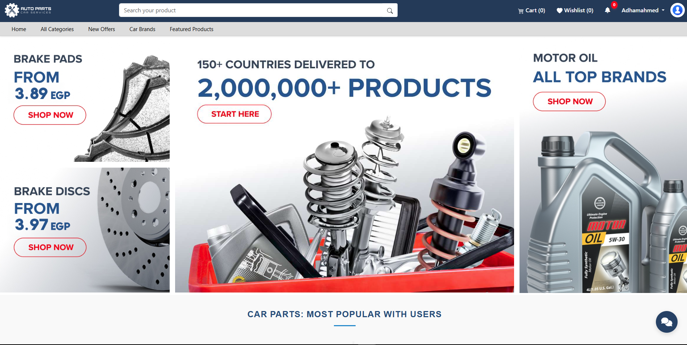
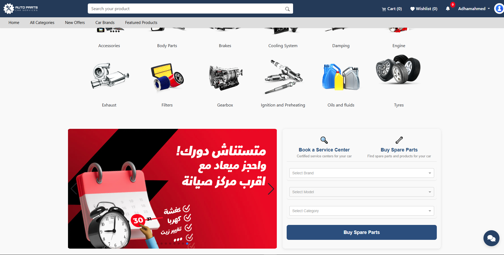
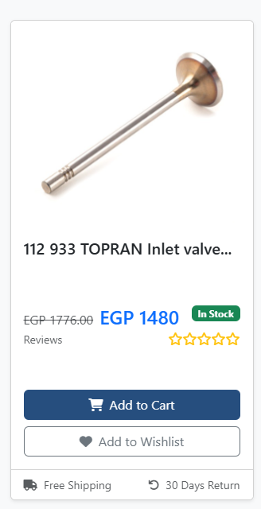
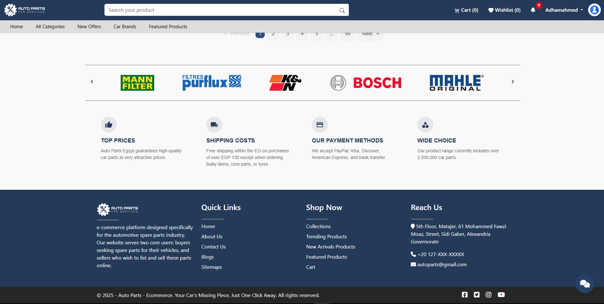
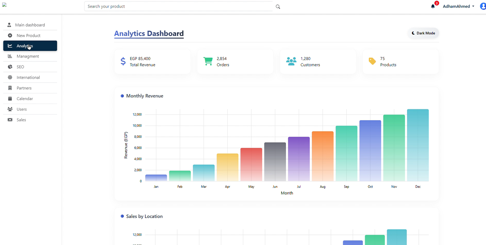
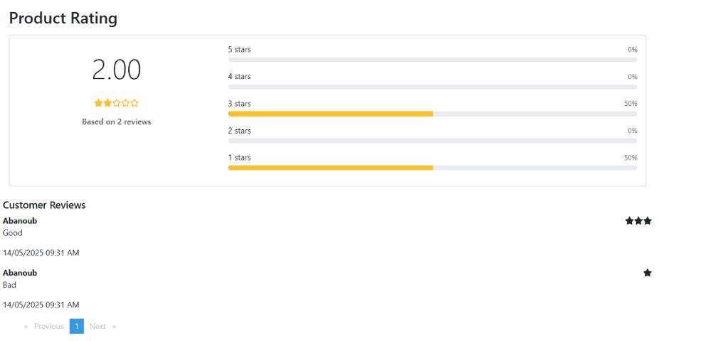
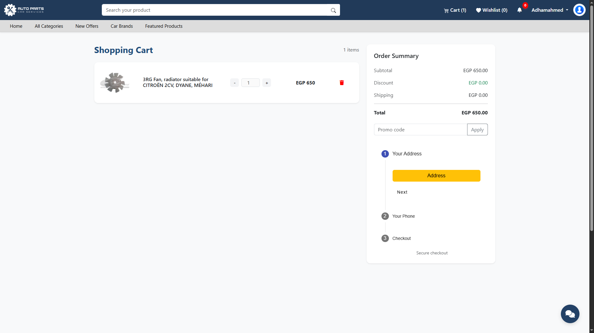
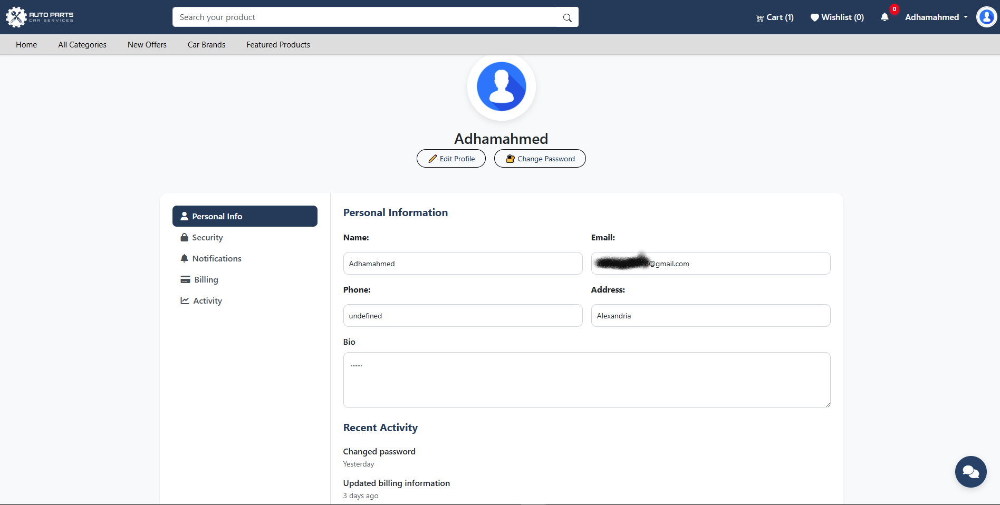
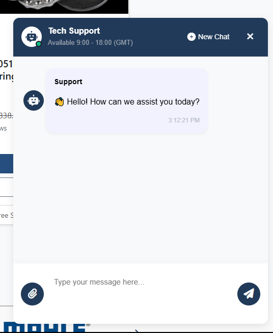
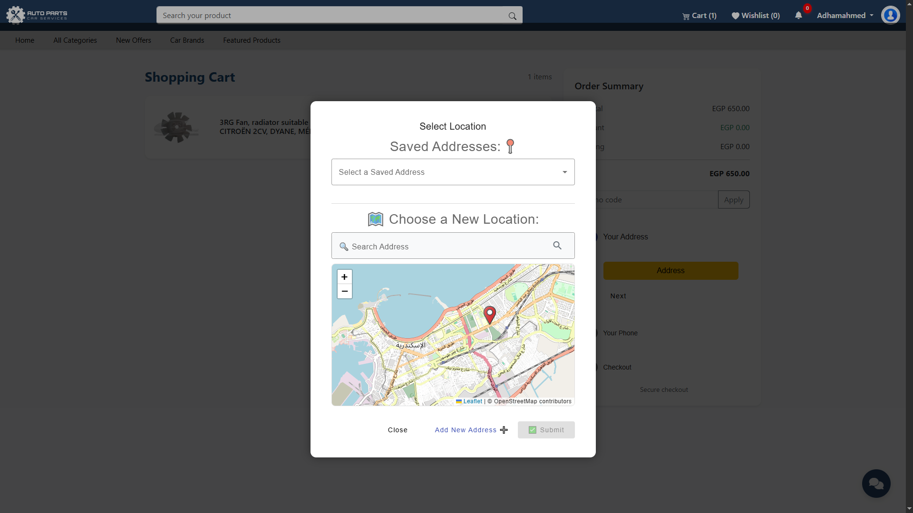

# AutoParts - E-Commerce Platform (Graduation Project)

This project is a smart and AI-powered e-commerce website specialized in selling and buying automotive spare parts in Egypt.

The website provides a seamless digital experience for:
- **Buyers:** through smart search, AI-based part recognition via image, and compatibility checks.
- **Sellers:** through easy product listing, a smart dashboard, and automatic analytics.

> 🎓 Graduation Project – Faculty of Business, Alexandria University  
> 🧑‍💻 My Role: Front-End Developer (Angular 19)  
> 📅 Year: 2025

---

## 🛠️ Technologies Used

- Angular 19, HTML5, CSS3, TypeScript
- Angular Material, Bootstrap
- SignalR, Firebase (Notifications), .NET Core (Back-end)
- Microsoft SQL Server, Swagger, Vercel (Deployment)

---

## 🌟 Key Features

- AI Chatbot (search by image or text)
- Product compatibility filter by car model
- Buyer/Seller registration + dashboards
- Real-time notifications and order tracking
- Admin analytics + performance metrics

---

> ## 📸 Screenshots

### 🏠 Home Page

#### 🔹 Header & Top Section

#### 🔹 Middle Section

#### 🔹 Product Display Section

#### 🔹 Footer + Additional Content

---

### 📊 Analytics Dashboard

---

### ⭐ Product Rating

---

### 🛒 Shopping Cart

---

### 👤 User Profile

---

### 🤖 AI Chatbot
git add README.md

---

### 🗺️ Location Map (Set Delivery Address)

---

© 2025 - Adham Ahmed Mouwad
"# Forced Edit" 
